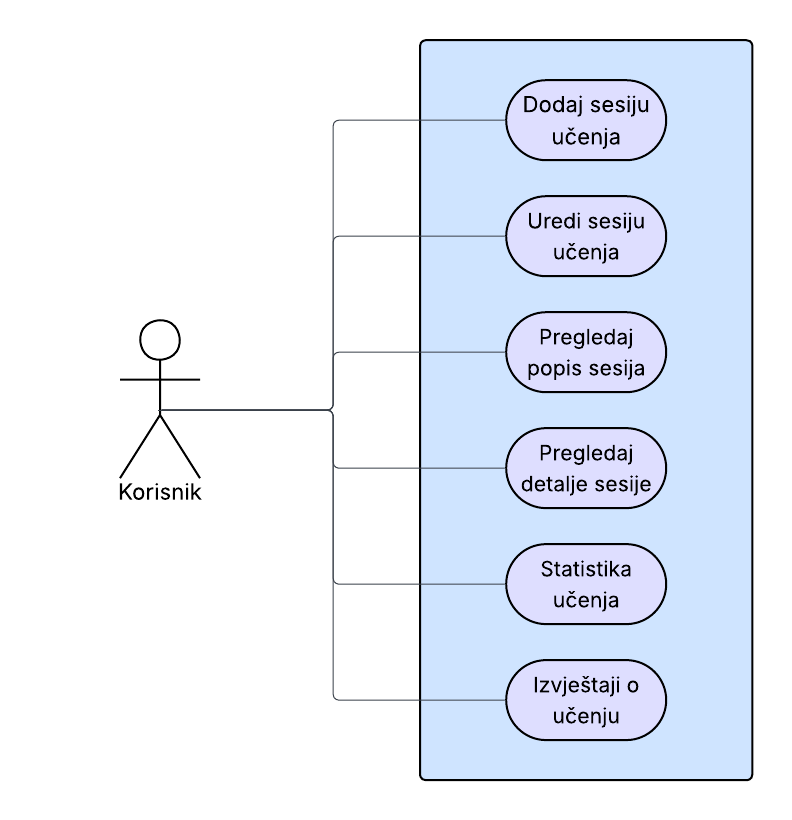

# Student Study Planer

## Opis projekta

Student Study Planer je jednostavan web servis koji studentu omogućuje vođenje evidencije o sesijama učenja. Svaka sesija bilježi kolegij, datum, broj sati i temu učenja. Aplikacija može pomoći studentima u organizaciji vremena, praćenju navika te analizi koliko vremena ulažu u pojedine kolegije.

Korisnik putem web sučelja može dodati novu sesiju učenja, pregledati sve spremljene sesije, urediti postojeću sesiju ili je obrisati. Na stranici statistike prikazuje se ukupan broj sati učenja i pregled sati po kolegiju. Backend dodatno nudi API rute za dohvat, dodavanje, uređivanje i brisanje podataka.

## Funkcionalnosti

- Dodavanje sesije učenja
- Pregled svih sesija učenja
- Pregled detalja sesije putem API-ja
- Uređivanje sesije učenja
- Brisanje sesije učenja
- Pregled ukupnog broja sati učenja
- Pregled sati učenja po kolegiju
- Jednostavan prikaz statistike pomoću HTML-a i CSS-a
- Filtriranje sesija po kolegiju putem API-ja
- Filtriranje sesija po datumu putem API-ja

## Tehnologije

- Python
- Flask
- PonyORM
- SQLite
- HTML
- CSS
- Bootstrap
- Docker

## Use case dijagram



## Pokretanje aplikacije lokalno kroz Docker

Za pokretanje aplikacije potrebno je imati instaliran Docker.

U glavnom direktoriju projekta pokreće se naredba:

```bash
docker compose up --build
```

Nakon pokretanja aplikacija je dostupna na adresi:

```txt
http://localhost:5000
```

Za zaustavljanje aplikacije koristi se naredba:

```bash
docker compose down
```
